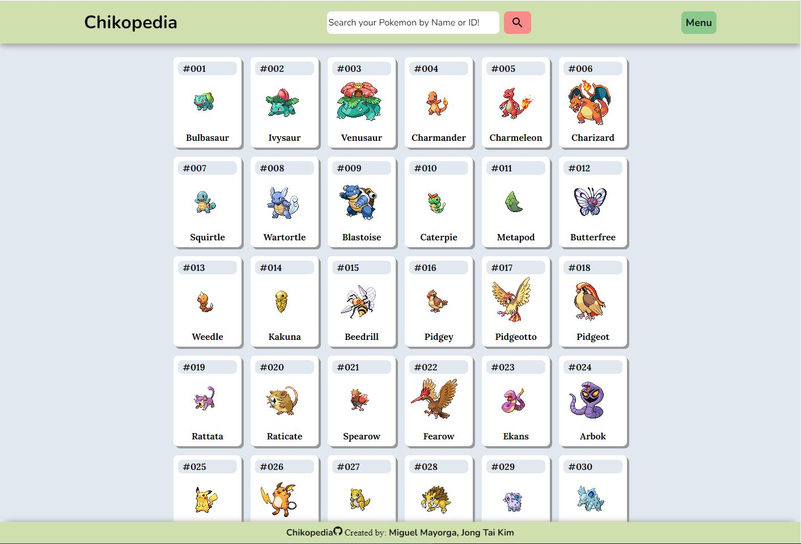
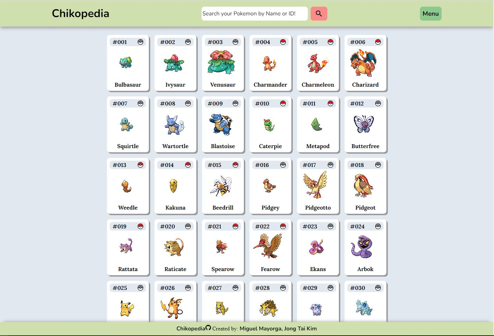
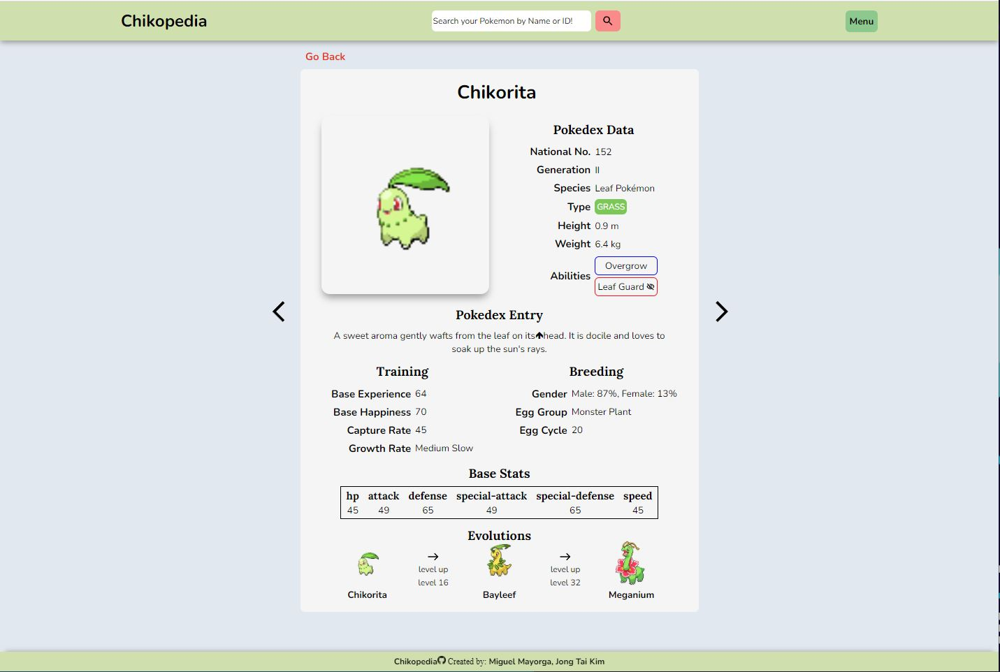
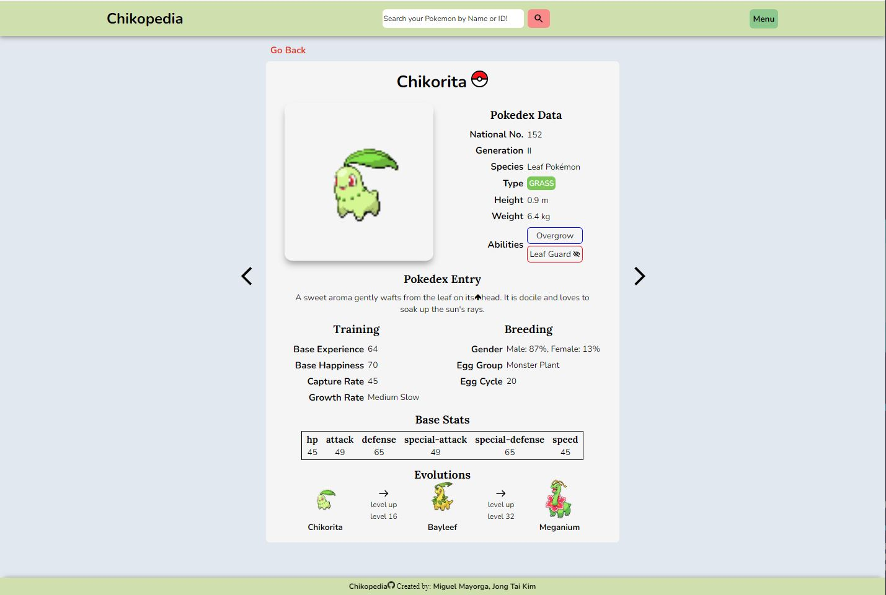
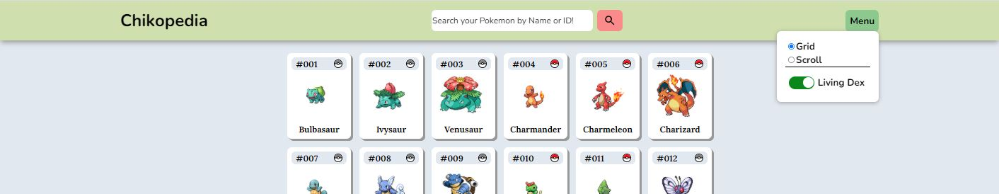

# Chikopedia (Pokedex)

Created by:
<a class="link-formatter" href="https://github.com/madebymiguel" target="_blank"
              >Miguel Mayorga</a
            >,
<a class="link-formatter" href="https://github.com/warandstar" target="_blank"
              >Jong Tai Kim</a>.

We, as pokemon lovers, are creating an application that mimics the pokedex, such that the users are able to search for pokemon information and to record the pokemon the users have caught so far.


^^ Root page with Grid View toggle


^^ Root page with Grid View toggle and livingdex on


^^ Pokedex Pokemon Entry


^^ Pokedex Pokemon Entry with livingdex on


^^ Pokedex Menu

## Setup

To set up the server locally, run the following:

```shell
npm i && npm start
```

## Built With

- [PokeAPI](https://pokeapi.co/)
- React
- TypeScript
- SASS

## Live Demo

A live demo is currently being hosted on [Heroku](https://chikopedia.herokuapp.com/).

## Features include:

- Being able to search Pokemon by Pokemon Name or ID
  - Implemented fuzzy search which allows typo correction
- Seeing all of the Pokemon through the grid view
- Pokemon are clickable through the grid and takes you to the Pokemon Pokedex Entry
- In Pokedex Entry there is a Carousel feature that lets you go to previous or next Pokemon Pokedex Entry
- In Menu there is a livingDex toggle that allows you to save the pokemon you caught in the grid view or the Pokedex Entry
  - Grey pokeball means you don't have it and red means you do
