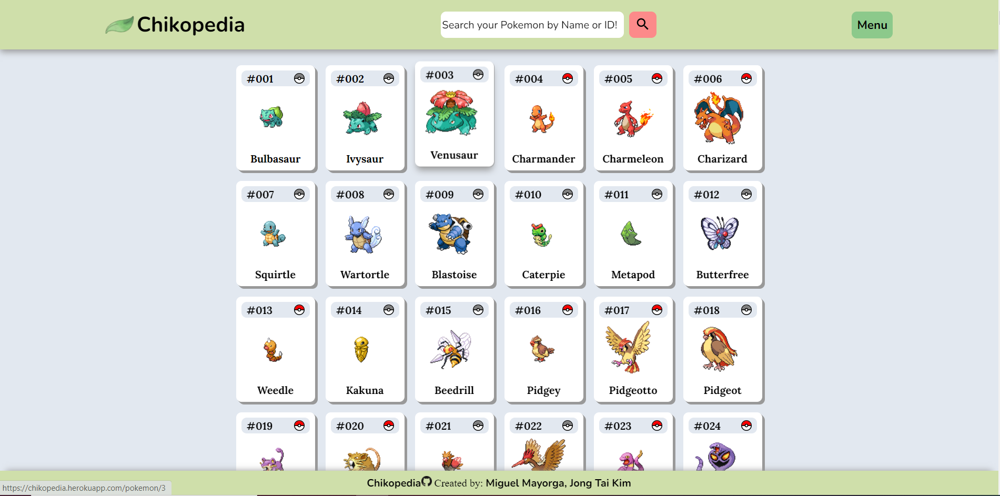
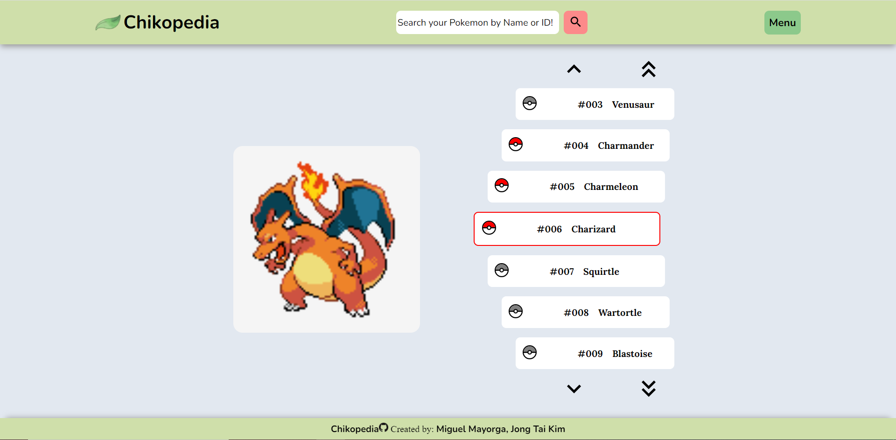
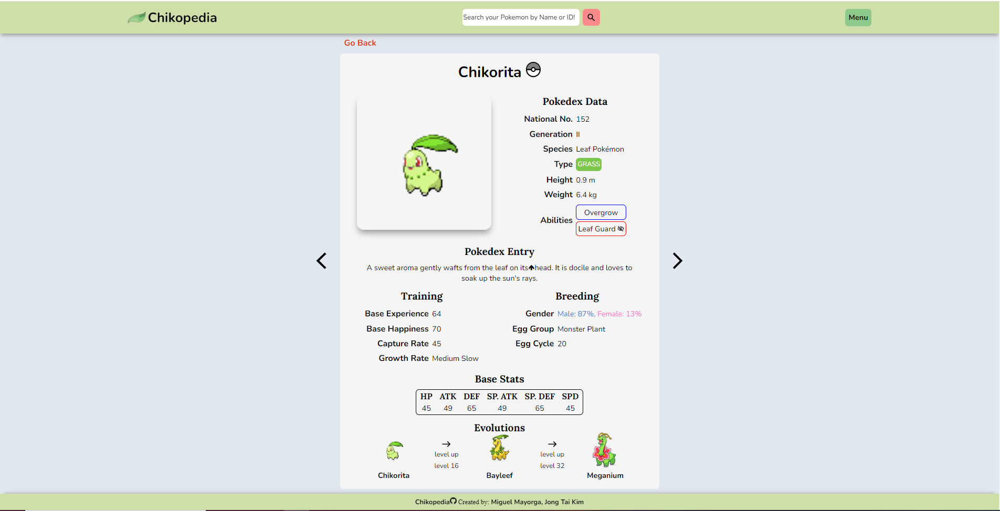
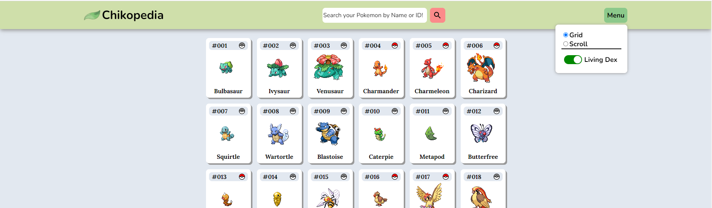

# Chikopedia (Pokedex)

Created by:
<a class="link-formatter" href="https://github.com/madebymiguel" target="_blank"
              >Miguel Mayorga</a
            >,
<a class="link-formatter" href="https://github.com/warandstar" target="_blank"
              >Jong Tai Kim</a>.

We, as pokemon lovers, are creating an application that mimics the pokedex, such that the users are able to search for pokemon information and to record the pokemon the users have caught so far.

<figure>

<figcaption align = "center"><b>Pokemon Grid View</b></figcaption>
</figure>

<figure>

<figcaption align = "center"><b>Pokemon Scroll View</b></figcaption>
</figure>

<figure>

<figcaption align = "center"><b>Pokemon Entry View</b></figcaption>
</figure>

<figure>

<figcaption align = "center"><b>Menu</b></figcaption>
</figure>

## Setup

To set up the server locally, run the following:

```shell
npm i && npm start
```

## Built With

- [PokeAPI](https://pokeapi.co/)
- React
- TypeScript
- SASS

## Live Demo

A live demo is currently being hosted on [Heroku](https://chikopedia.herokuapp.com/).

## Features include:

- Being able to search Pokemon by Name or ID
  - Implemented fuzzy search which allows typo correction
- Two Pokemon views:
  - Grid: Pokemon are clickable through the grid items and takes you to the its Pokedex Entry
  - Scroll: Pokemon are clickable through the sprite box and takes you to the its Pokedex Entry. Displays at most 7 Pokemon at a time. Single arrows takes you to the previos or next set of pokemon. The double arrows takes you to the first or last Pokemon. Clicking a Pokemon box displays that pokemon sprite.
- In Pokedex Entry there is a Carousel feature that lets you go to previous or next Pokemon's Pokedex Entry
- In the Menu there is:
  - The ability to switch from Grid or Scroll view
  - The ability toggle the livingDex ON or OFF:
    - LivingDex allows you to save the Pokemon you caught
    - If ON it diplays pokeball in Grid, Scroll and Pokedex Entry
    - Grey pokeball means you don't have it and red means you do
